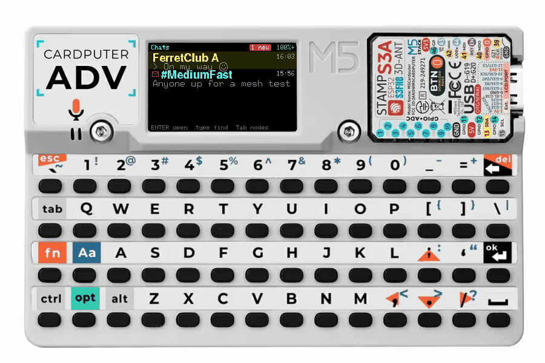
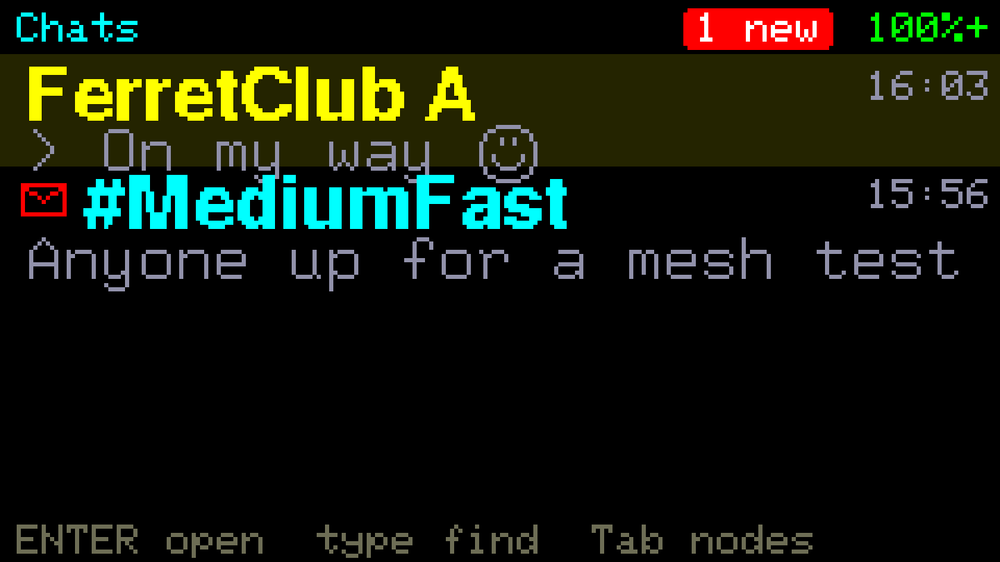
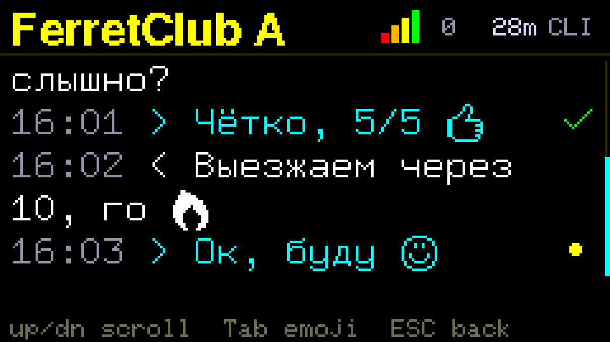
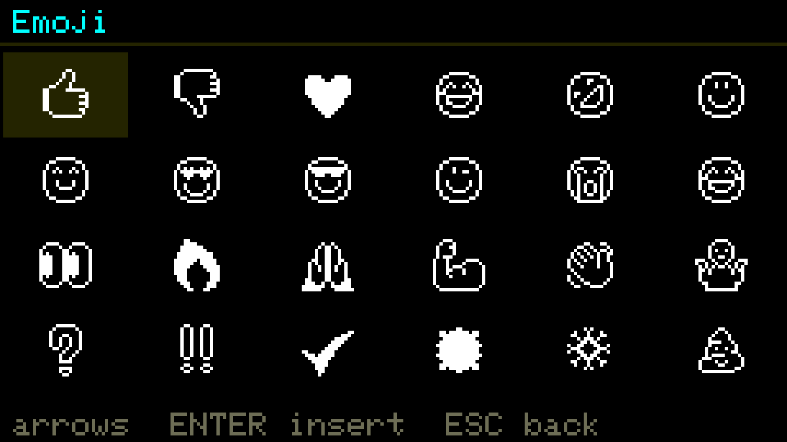
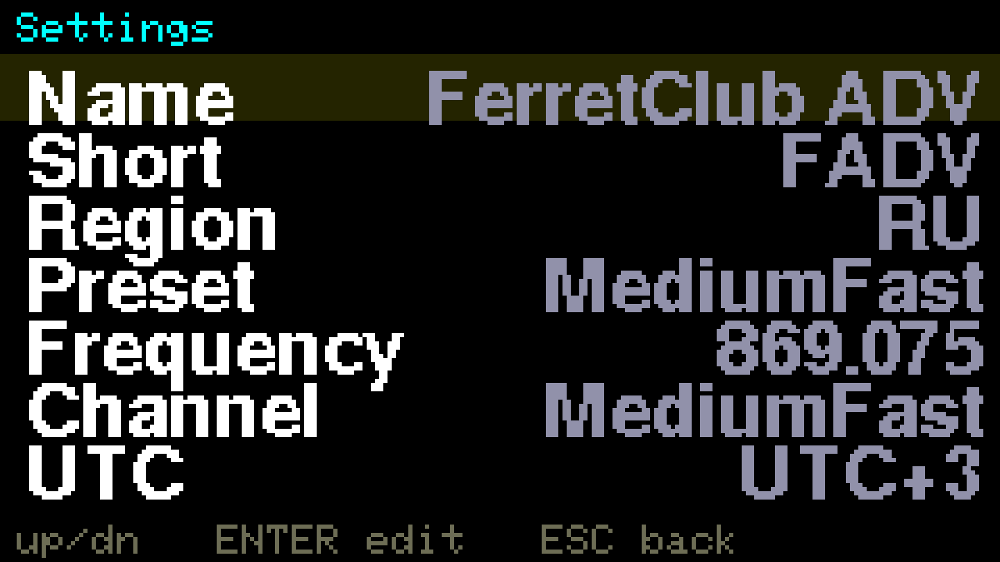
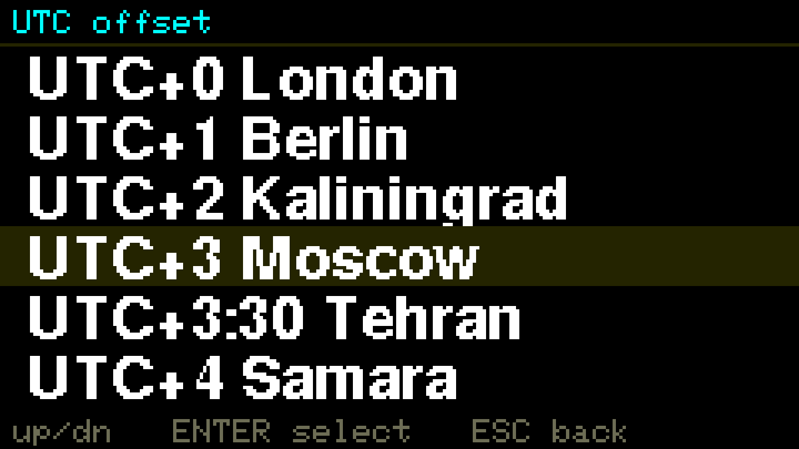

# Meshtastic ADV

**English** | [Русский](README.ru.md)

**A keyboard-first [Meshtastic](https://meshtastic.org) client for the [M5Stack Cardputer ADV](https://shop.m5stack.com/products/m5stack-cardputer-adv) — with its own Cap LoRa-1262 (SX1262), or driving any stock Meshtastic node over Bluetooth.**

A from-scratch on-device UI focused on one thing: making it genuinely comfortable to **message people over the mesh** from a pocket QWERTY device — no phone required — while keeping the proven Meshtastic radio stack underneath. No LoRa cap? [Companion mode](#companion-mode-drive-another-node-over-ble) turns the Cardputer into a terminal for a Heltec / T-Beam / RAK you already own.

<p align="center">
  
  <br/><sub>device render © <a href="https://shop.m5stack.com/products/m5stack-cardputer-adv">M5Stack</a> · the screen is the real UI</sub>
</p>
<p align="center">
  
  
</p>

> **[▶ Install in your browser](https://anton-vinogradov.github.io/meshtastic-adv/)** — one click, no toolchain (desktop Chrome/Edge).

## Why

The Cardputer has a real keyboard, a colour screen, a speaker and an SD card — but the stock on-device Meshtastic UI barely uses any of it, and typing a message on it is painful. This project **keeps the Meshtastic mesh engine 100% intact** (LoRa PHY, routing, PKI crypto, node DB, protobufs) and replaces **only the UI/input layer** with a clean chat experience built for the keyboard.

You get a device that boots straight into a usable messenger: pick a contact, type, hit enter.

## What it does

- **🗨️ Recent chats home** — boots into your conversations (DMs + channels), newest first, each with a last-message preview, time and unread badge. Opening one jumps straight to the first unread message.
- **💬 Direct messages** — open a node, type, send. PKI-encrypted DMs like the phone app.
- **📢 Channels** — read and broadcast to any channel, right alongside your DMs.
- **✅ Delivery status** — every sent message shows *sending* (dot) → *delivered* (green check, from the routing ACK) → *failed* (red ✗ with the reason). Channel broadcasts get a "sent" check.
- **⌨️ Cyrillic input + 😀 emoji** — type Russian on the Latin keyboard via a live transliteration layer (**Fn+L**); receive/render non-Latin text and inline emoji bitmaps; a **Tab** palette inserts emoji.
- **🈶 Full Unicode text** — CJK, Greek, Hebrew, Arabic… any script in the Basic Multilingual Plane renders in messages and names, via a GNU Unifont partition the installer flashes automatically (Latin/Cyrillic stay on the fast embedded font).
- **📇 Node list** — press **Tab** for everyone on the mesh, with a signal-bar meter (from SNR), hop count, last-heard age and role, in fixed columns.
- **🔎 Contact search** — start typing to find any node and start a new chat.
- **⭐ Favourites** — flag contacts and channels; they get priority alerts.
- **🔔 Sound + light** — a single beep **and** a green LED flash from a favourite; a blue flash for everyone else (no buzzing on every packet).
- **🕘 Timestamps** — compact local `HH:MM` on every message, with a UTC-offset (city) picker and a manual clock setting for meshes with no time source.
- **📡 WiFi + MQTT, on-device** — join WiFi and bridge the mesh to the internet over MQTT (default public broker or your own), configured right on the device — no phone needed. WiFi also sets the clock via NTP.
- **💾 History that survives reboots** — the conversation ring is persisted to flash.
- **⚙️ On-device settings** — name, region, modem preset, frequency, channel, role, hop limit, TX power, rebroadcast mode, UTC, WiFi and MQTT, all editable on the device (long-press **ESC**).
- **🔋 Screen auto-off** — the display powers down after 15 s…5 min idle (your pick); any key wakes it, alerts still beep and flash the LED while it's dark.
- **📱 Phone app still works** — the stock Bluetooth API stays on: pair the official Meshtastic app (the Cardputer shows the pairing PIN) and use it alongside the on-device UI.
- **🔗 Companion mode** — no LoRa cap? Pair the Cardputer with **any stock Meshtastic node** (Heltec, T-Beam, RAK…) over Bluetooth and use its radio: the whole chat UI above, through the other node. [Details below.](#companion-mode-drive-another-node-over-ble)

<p align="center">
  
  
  
</p>

<p align="center"><b><a href="docs/interface.md#screens-at-a-glance">▶ See every screen with captions →</a></b></p>

## Install

The easiest way is the **[web installer](https://anton-vinogradov.github.io/meshtastic-adv/)** (ESP Web Tools):

1. Attach the **LoRa antenna** to the Cap first — *never power the PA without it.*
2. Open the page in desktop **Chrome** or **Edge**, plug the Cardputer in with a **data** USB-C cable.
3. Click **Install**. If the device isn't listed, hold **G0/BOOT** while connecting, then release.
4. After flashing, long-press **ESC** → set your **Region** and **UTC**.

Prefer the CLI? Grab `firmware.factory.bin` from the [latest release](https://github.com/anton-vinogradov/meshtastic-adv/releases) and flash at offset `0x0` with esptool; add `unifont.bin` at `0x340000` for the full-Unicode font (or drop it on the SD card root instead).

## How to drive it

Everything is keyboard-driven. The footer of each screen shows the live hints.

| Where | Key | Action |
|---|---|---|
| Chats (home) | **↑ / ↓** · **Enter** | move · open the conversation |
| Chats (home) | **← / →** | favourite / un-favourite |
| Chats (home) | *type* | search all nodes to start a new chat |
| Chats (home) | **Tab** | switch to the full node list (and back) |
| Conversation | *type* · **Enter** | write a reply · send |
| Conversation | **Fn+L** | toggle Cyrillic (translit) input |
| Conversation | **Tab** | emoji palette |
| Conversation | **↑ / ↓** | scroll through history |
| Conversation | **ESC** | back |
| Anywhere | **long-press ESC** | open Settings |

In Settings, **↑/↓** move, **Enter** edits (toggles for on/off items), **ESC** goes back. Changing Region/Preset/Frequency/Channel, or WiFi/MQTT, reboots to apply. Enabling WiFi turns Bluetooth off (Meshtastic behaviour).

## Companion mode: drive another node over BLE

The Cardputer can act as a **keyboard + screen terminal for a separate Meshtastic node** instead of (or without) its own LoRa cap. It connects as a BLE client to the node's standard Bluetooth API — the same one the phone app uses — so **the other node stays on stock firmware, zero changes**.

1. Long-press **ESC** → **Settings** → **Radio** → **Companion via BLE** → the device reboots into a scan.
2. Pick your node from the list, type the **PIN** shown on the node's screen.
3. Done — it downloads the node's contacts and channels and drops you into Chats. Everything works as usual (PKI DMs, delivery checkmarks, reactions, replies), just through the other node's radio.

A Bluetooth rune in the Chats header shows the link state; the link auto-reconnects after drops. **Settings → Radio** doubles as a status page (link signal, the node's battery, traffic; **R** reconnect, **F** forget the node). Switch back with **Radio → Onboard (Cap LoRa)**.

You can also **configure the linked node from the Cardputer**, like the phone app does: Settings shows the *node's* values, **Name / Short / Channel** apply instantly over the link, and **Region / Preset / Frequency** make the node save and reboot itself while the link recovers on its own.

> 📱 The node has a single Bluetooth slot — close the Meshtastic phone app while the Cardputer is linked, or they'll fight over it.

## Architecture

The UI and the mesh engine talk over the **same protobuf Client API** (`ToRadio` / `FromRadio`) the phone app uses — but in-process, on the same ESP32-S3, via a custom `PhoneAPI` implementation.

```
  ┌─────────────────────────────┐        ToRadio / FromRadio        ┌──────────────────────────┐
  │  UI (this project, scratch) │  ───────────────────────────────▶ │  Meshtastic mesh engine  │
  │  keyboard · screen · sound  │  ◀─────────────  protobuf  ─────── │  (upstream, unmodified)  │
  └─────────────────────────────┘                                   │  LoRa · routing · crypto │
                                                                    └──────────────────────────┘
```

- **Same feature set as stock** — anything the engine can do is reachable through the API the phone uses.
- **UI is fully ours** — the stock `Screen` / canned-message / input modules are disabled.
- **No fork** — upstream `meshtastic/firmware` is a pristine git submodule; our code lives in an `overlay/` that is copied in at build time with two tiny `main.cpp` injections. Pulling newer upstream doesn't break the UI.

See [docs/interface.md](docs/interface.md) for the on-screen details and [HARDWARE.md](HARDWARE.md) for the Cap LoRa-1262 pinout.

## Hardware

| Part | Detail |
|---|---|
| MCU | M5Stack Cardputer ADV — Stamp-S3A (ESP32-S3FN8, 8 MB flash, **no PSRAM**) |
| Radio | Cap LoRa-1262 — Semtech **SX1262**, 868–923 MHz, external antenna — *or* any stock Meshtastic node over BLE (companion mode) |
| Display | 1.14" 240×135 IPS |
| Input | 56-key QWERTY |
| Audio | ES8311 codec + speaker |
| Extras | microSD, RGB LED, RTC, battery |

> ⚠️ Never power the LoRa cap without the antenna attached — the PA can be permanently damaged.

## Build from source

```sh
git clone --recursive https://github.com/anton-vinogradov/meshtastic-adv
cd meshtastic-adv
scripts/flash.sh        # syncs the overlay, builds, uploads, resets
```

Requires PlatformIO. The build env is `m5stack-cardputer-adv-advui`. `scripts/sync-overlay.sh` copies `overlay/` into the submodule and applies the injections; `scripts/flash.sh` also handles the native-USB reset dance.

## Status

The read **and** write paths are done and running on real hardware: node list, DMs, channels, delivery status, Cyrillic, emoji, reactions, replies, favourites, sound, timestamps, persisted history, on-device settings and BLE companion mode all work today. Companion mode is verified end-to-end over the air (encrypted DM through the linked node, routing ACK back).

Next up: full-Unicode font from SD (CJK) and quality-of-life polish.

## License

GPL-3.0 (matches the upstream Meshtastic firmware this builds on). The bundled Unicode font is [GNU Unifont](https://unifoundry.com/unifont/) (SIL OFL 1.1 / GPLv2+ with the font-embedding exception).

*Meshtastic® is a registered trademark of Meshtastic LLC. This is an unofficial, community project, not affiliated with or endorsed by Meshtastic LLC.*
