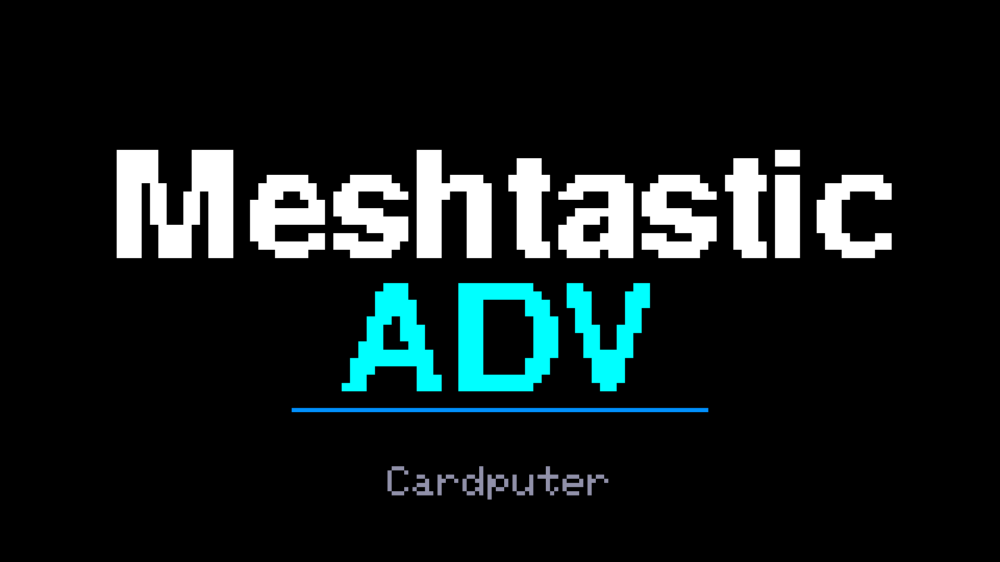
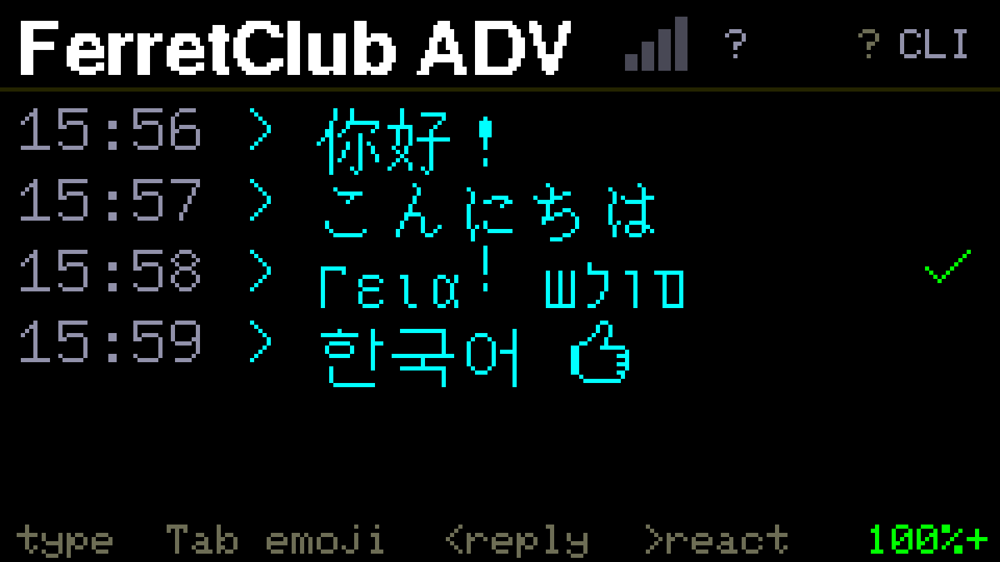
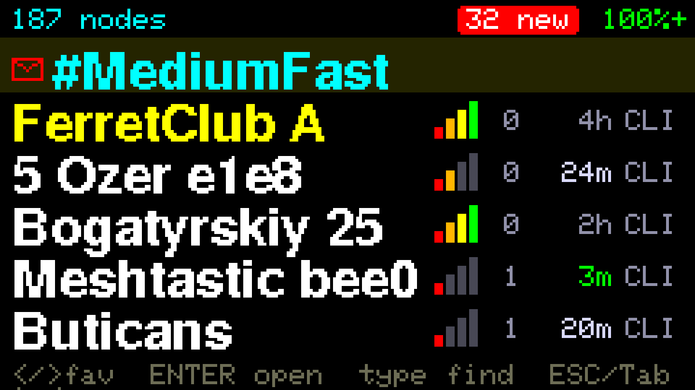
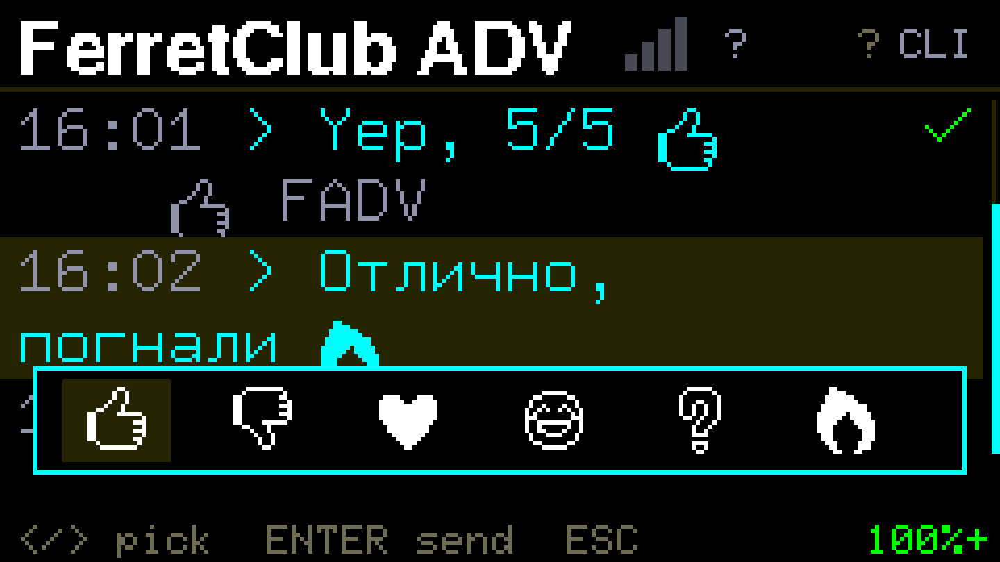
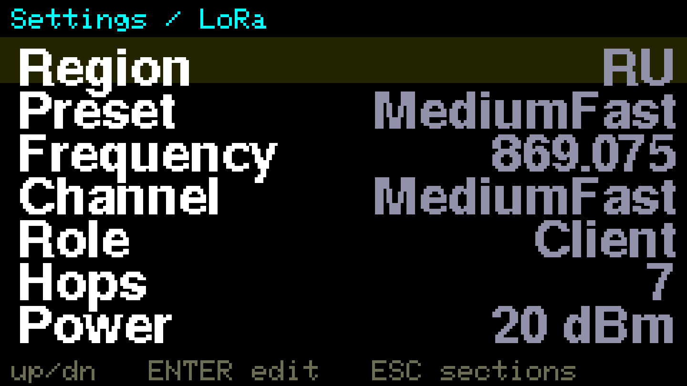
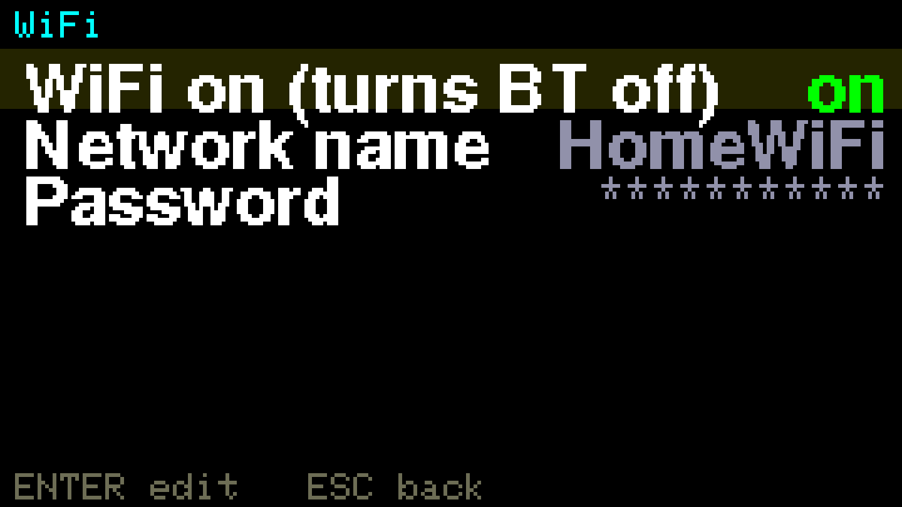
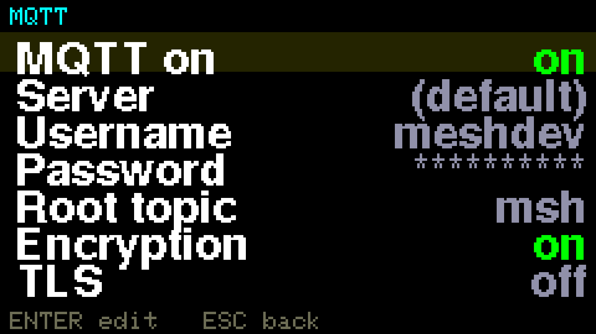
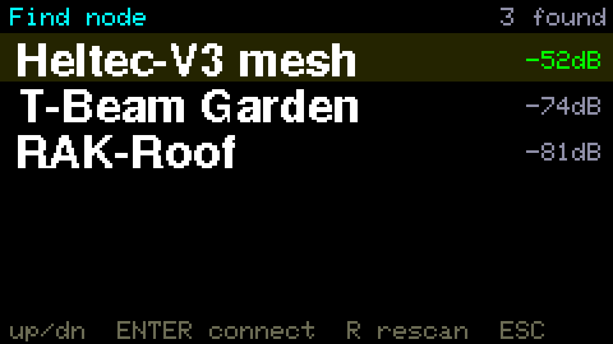
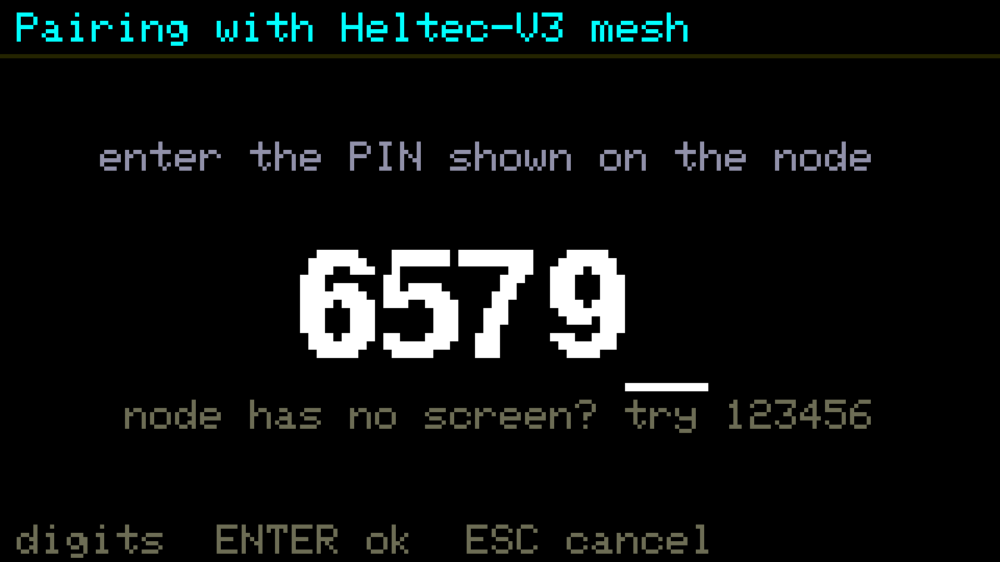
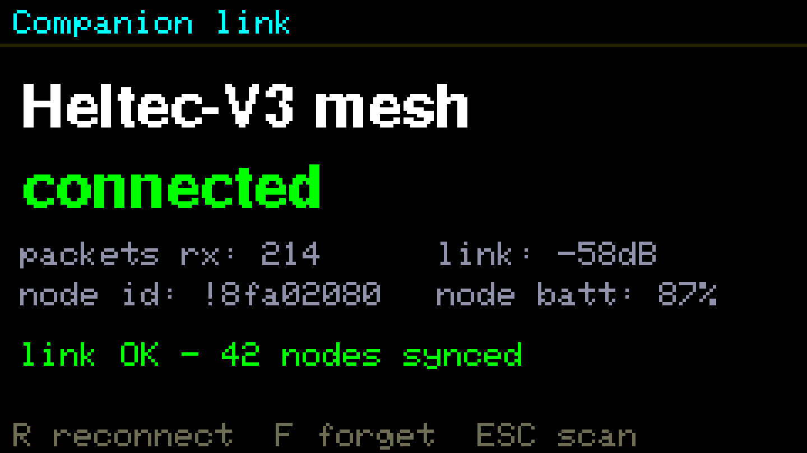

# Interface — the on-device app

**English** | [Русский](interface.ru.md)

The advui firmware replaces the stock Meshtastic screen with a keyboard-first UI built
for the Cardputer ADV. This is the guide to what's on screen and how to drive it.

The engine underneath is unmodified upstream Meshtastic, so the node still behaves like a
normal Meshtastic device on the mesh — this only changes the local UI. In **companion
mode** the same UI drives a *different* node's radio over Bluetooth instead (see the end).

## Screens at a glance

<table>
<tr>
<td align="center" width="33%"><br><sub><b>Splash</b> — branded boot screen</sub></td>
<td align="center" width="33%"><br><sub><b>Chats</b> — home: recent DMs + channels, unread badges</sub></td>
<td align="center" width="33%"><br><sub><b>Conversation</b> — Cyrillic, inline emoji, delivery checks</sub></td>
</tr>
<tr>
<td align="center" width="33%"><br><sub><b>Full Unicode</b> — CJK / Greek / Hebrew / Korean text</sub></td>
<td align="center" width="33%"><br><sub><b>Node list</b> — signal, hops, last-heard, role</sub></td>
<td align="center" width="33%"><br><sub><b>Emoji palette</b> — Tab to insert</sub></td>
</tr>
<tr>
<td align="center" width="33%"><br><sub><b>Reactions</b> — tapback strip on a picked message</sub></td>
<td align="center" width="33%"><br><sub><b>Settings</b> — sectioned menu with value previews</sub></td>
<td align="center" width="33%"><br><sub><b>LoRa settings</b> — region, preset, role, hops, power</sub></td>
</tr>
<tr>
<td align="center" width="33%"><br><sub><b>UTC picker</b> — offset by city</sub></td>
<td align="center" width="33%"><br><sub><b>WiFi</b> — join a network, NTP time</sub></td>
<td align="center" width="33%"><br><sub><b>MQTT</b> — bridge the mesh to the internet</sub></td>
</tr>
<tr>
<td align="center" width="33%"><br><sub><b>Companion: find node</b> — scan for a stock node over BLE</sub></td>
<td align="center" width="33%"><br><sub><b>Companion: pairing</b> — type the PIN from the node</sub></td>
<td align="center" width="33%"><br><sub><b>Companion: link status</b> — signal, node battery, synced nodes</sub></td>
</tr>
</table>

## Screens

### Splash

On boot you get a branded **`Meshtastic ADV`** splash for ~2 seconds (or until you press a
key) while the mesh engine comes up. Then it drops into Chats.

### Chats (home)

Your recent conversations — DMs and channels mixed, newest first.

```
 Chats                     [2 new]  78%    <- title · unread badge · our battery
 ------------------------------------------
 ✉ SPb Gate                        14:02   <- unread envelope · name · last-msg time
   hi, anyone near Nevsky?                 <- preview of the last message
 # MediumFast                      13:47
   KSV: back online
   Neva Bridge                     12:30
   > see you there                         <- ">" = the last message is ours
 type find   Tab: all nodes
```

- **Row = conversation.** Channels are prefixed `#` (cyan), favourites are yellow, a red
  envelope marks unread. The preview shows the sender's short name in channels and `>` when
  the last word was yours.
- **Enter** opens the conversation **at the first unread message**.
- **← / →** un-favourite / favourite the selected contact or channel.
- **Typing** searches *all* nodes to start a new chat; **Tab** switches to the full node list.
- In companion mode a small **Bluetooth rune** next to the title shows the link state
  (green = linked, yellow = reconnecting, red = down).

### Node list (Tab)

Everyone the node DB knows, one row per node.

```
 42 nodes                  [2 new]  78%    <- nodes known to the mesh · battery
 ------------------------------------------
 ✉ ksv-relay      ▂▄▆_   →1   4m    CLI
 * SPb Gate       ▂▄▆█   →0   now   RTR    <- * favourite (yellow)
   Neva Bridge    ▁___   →3   12m   RTR
 </>fav  ENTER open  type find  ESC/Tab chats
```

- **Sort:** unread first → favourites → nodes you talk to → everyone else by hop distance.
- **↑ / ↓** move (the list scrolls), **Enter** opens the node, **← / →** manage favourites,
  **typing** filters by name, **ESC** or **Tab** returns to Chats.

Reading a row:

| Field       | Meaning                                                                        |
| ----------- | ------------------------------------------------------------------------------ |
| **name**    | long name (falls back to short name, then `!nodenum`); yellow = favourite       |
| **signal**  | 0–4 bars from the last direct SNR (green strong → orange weak); empty = heard only via relays |
| **`→N`**    | hops away: `→0` direct neighbour · `→?` unknown                                 |
| **age**     | last heard: `now` · `5m` · `2h` · `3d`; green fresh, grey stale                 |
| **role**    | `CLI` client · `RTR` router · `RPT` repeater · `TRK` tracker · `SEN` sensor · `TAK` |

### Conversation

The thread view — a DM or a channel. The header repeats the node/channel row, messages fill
the middle, the compose bar sits at the bottom.

```
 SPb Gate         ▂▄▆█   →0   now   RTR
 ------------------------------------------
 13:58 > Are you around?             ✓     <- our message · delivery check
 [13:58 > Are you around?]                 <- framed quote of the original
 14:02 < yes! near the bridge              <- their reply to it
 14:03 > 👍
 _                                    RU   <- compose bar · input-mode badge
 type  Tab emoji  <reply  >react
```

- **Every message** carries a compact local `HH:MM` (set your UTC offset in Settings) and a
  direction mark: `>` sent, `<` received. In channels received messages also show the
  sender's short name. Messages that arrive before the clock has synced are remembered by
  their uptime moment and get their real stamps backfilled the instant time arrives (within
  the same boot; across a power loss the arrival time is genuinely unknowable and stays blank).
- **Delivery status** on your messages: a grey dot while sending → a **green ✓** on the
  routing ACK (channel broadcasts get their ✓ on transmit) → a **red ✗ with the reason** on
  failure. When the newest message has failed, **Enter resends it**.
- **↑ / ↓** scroll the history — **hold to keep scrolling** (arrows auto-repeat everywhere,
  and so does backspace while erasing text); opening a thread auto-jumps to the first unread.
- **Scrolling past the top pages into the flash archive**: messages evicted from the live
  window aren't gone — the newest 256 land in an archive on internal flash, and ↑ at the top
  of the thread walks back through them 16 at a time (the footer shows `history N-M/K`;
  ↓ at a page bottom moves toward newer, **ESC** returns to the live view). Deleting a chat
  wipes its archive too.
- **Type** and hit **Enter** to send. **Fn+L** toggles the Cyrillic transliteration layer
  (the `RU`/`EN` badge on the compose bar; the choice persists). It's phonetic:
  `zh`→ж · `sh`→ш · `ch`→ч · `sch`→щ · `ya`→я · `yu`→ю · `yo`→ё · `ye`→э · `y`→ы ·
  `j`→й · `x`→ъ · `'`→ь · `h`→х · `c`→ц · `e`→е · `q`→я. **Tab** opens the emoji
  palette (~24 icons, arrows + Enter to insert; emoji render inline in text).
- **← / →** enter *message pick* mode: ↑/↓ choose a received message, then
  - **→ reaction** — a quick strip of tapbacks (`</>` pick, Enter sends). Reactions from
    others (including phone apps) show under the message they refer to.
  - **← reply** — quotes the picked message in your next send; the thread draws the quote
    in a frame above your message, with the original's time and sender inside (often its
    only surviving trace once the original scrolls out of history), and phone apps render
    it as a proper reply.
  - Messages from very old history (pre-reactions builds) have no packet id and can't be
    reacted to — the footer says so.
- **ESC** goes back. The footer's right corner always shows **our own battery**.

### Settings (long-press ESC anywhere)

Two levels: the top menu shows sections with a live preview of the key value; Enter opens
a section (or WiFi / MQTT / Radio directly), ESC steps back up.

| Section | Rows |
| ------- | ---- |
| **Node**   | **Name** and **Short** — the node's long/short names (text editor)         |
| **LoRa**   | **Region** (required on first boot) · **Preset** (LongFast, MediumFast, …) · **Frequency** (slot override, MHz) · **Channel** (primary name; key kept) · **Role** (Client, Client Mute/Hidden, Router (Late), Repeater, Tracker, Sensor, TAK) · **Hops** (1–7) · **Power** (region max or 2–22 dBm) · **Rebroadcast** (All / Local only / Known only / Core ports only / None) |
| **WiFi**   | join a network (NTP time comes with it); enabling WiFi turns Bluetooth off |
| **MQTT**   | bridge the mesh to the internet: default public broker or your own         |
| **Device** | **UTC** — offset picker with city labels, drives all timestamps · **Clock** — the device time, `not set` until it syncs; type `HH:MM` to set it by hand when there's no phone, NTP or GPS node around (the clock resets on every reboot, and messages received while it's unset stay timeless) · **Screen** — auto-off timeout (15 s … 5 min or never; default 5 min) · **Font** — where the Unicode font came from (`flash` / `sd` / `off`), read-only |
| **Radio**  | **Onboard (Cap LoRa)** or **Companion via BLE** — see below                |

**↑/↓** move, **Enter** edits (or toggles), **ESC** backs out. Changes that affect the radio
(everything under LoRa, WiFi / MQTT, Radio mode) reboot the device to apply.

In **companion mode** the Node and LoRa sections show — and edit — **the linked node**
instead (see below); WiFi / MQTT / Device / Radio stay local to the Cardputer.

### Companion mode (Settings → Radio → Companion via BLE)

The Cardputer becomes a keyboard + screen terminal for **another, stock Meshtastic node**
(Heltec, T-Beam, RAK…) over Bluetooth — its own LoRa cap is not needed. The other node keeps
its normal firmware; the Cardputer talks to the same BLE client API the phone app uses.

1. **Scan** — after the reboot you land in *Find node*: nearby Meshtastic nodes with names
   and signal. `↑/↓` choose, **Enter** connects, **R** rescans.
2. **Pairing** — the first connect asks for the **PIN shown on the node's screen** (digits,
   Enter). The bond is remembered; later connects are automatic, including after reboots.
3. **Linked** — the node's contacts and channels download and you land in Chats. Everything
   above — PKI-encrypted DMs, delivery checkmarks, reactions, replies, channels — now goes
   through the linked node's radio.

While linked, the **Bluetooth rune** in the Chats header tracks the connection, and
**Settings → Radio** becomes a status page: link state, packets received, the node's id,
link signal (dB), **the node's battery**, and how many nodes have synced. **R** forces a
reconnect, **F** forgets the node (back to scan), **ESC** just leaves — the link stays up.
Drops auto-reconnect in the background.

**Settings drive the node remotely**, the way the phone app does: **Name / Short** and the
**Channel** name apply instantly over the link (the channel object round-trips with its key,
so the rename can't break encryption), while **Region / Preset / Frequency** make the node
save and reboot itself — the screen drops to the Radio status page and the link comes back
on its own. Screenless nodes usually pair with the stock PIN `123456` (the PIN screen
reminds you).

> 📱 The node has a single Bluetooth slot — close the Meshtastic phone app while the
> Cardputer is linked, or they'll steal the connection from each other.

## Odds and ends

- **History survives reboots** — the message ring (with reactions and reply links) is
  persisted to flash, as are all settings.
- **Sound + light:** one beep + green LED flash for favourites, a blue flash for everyone
  else — never a buzz per packet.
- **Screen auto-off** cuts the whole display rail after the configured idle time. Any key
  wakes it (that key is swallowed); incoming messages don't light it up — the beep and the
  LED do the notifying, the unread badges are there when you wake it.
- **Full Unicode:** messages and names in any BMP script (CJK, Greek, Hebrew, Arabic, …)
  **plus the emoji blocks** (U+1F000–U+1FBFF — so reactions and messages from phone users
  render as Unifont glyphs instead of tofu boxes; invisible modifiers like variation
  selectors, ZWJ and skin tones are skipped) via GNU Unifont — the installer flashes it
  into a dedicated partition, no user action; esptool users write `unifont.bin` at
  `0x340000` or drop it on the SD card root. Latin and Cyrillic stay on the fast embedded
  font either way.
- **Phone app:** the stock Bluetooth API is untouched, so the official Meshtastic app pairs
  with the Cardputer like with any node — a passkey screen pops up (waking the display) with
  the PIN to type on the phone. WiFi turns Bluetooth off, as in stock.
- The header counts **nodes heard in the last 24 hours** — a flash-backed ledger of every
  node identity ever met, so the number reflects the living mesh and never saturates at the
  storage caps (until the clock syncs it falls back to the stored-identity count). The list
  itself shows the 200 most current nodes with full data; in companion mode it mirrors the
  64 most recently heard while the header counts the linked node's whole DB from the sync
  stream.
- Other nodes' battery levels aren't stored by this build's compact node DB — only our own
  battery (header/footer) and, in companion mode, the linked node's.
